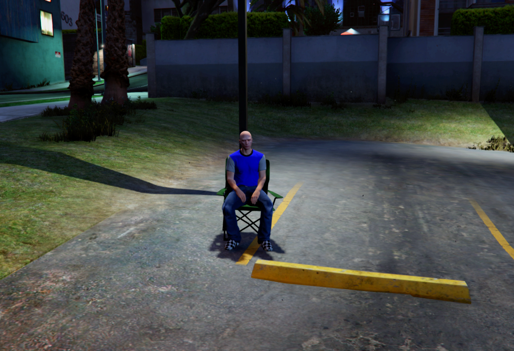

# altv-sit

## Features

This ressource adds the option to sit down on chairs, benches etc.
Providing a configuration file, the script allows you to add custom props to interact with.
Everything is synced and seats cannot be used by two people at the same time.

IMPORTANT NOTE: The offsets in the config file are not perfect and you might strugle with the player facing a prop, to fix this you need to change the `verticalOffset`, `forwardOffset`, `leftOffset` values to adjust the position of the player on a certian prop.

## Install

To install this script, just download the latest release or download the repository

## Usage

Press E near any bench, chair etc.

# I hope you enjoy my small script
